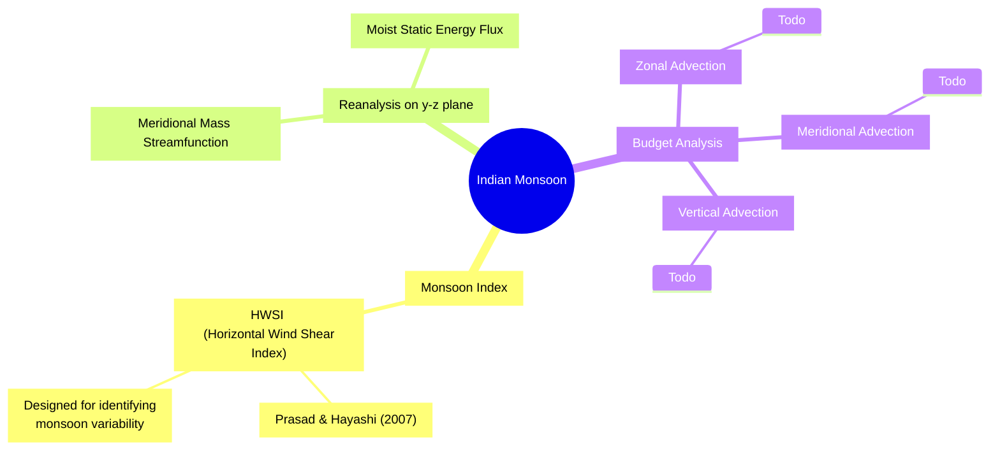

<!-- ```mermaid
flowchart TD
  subgraph A [monsoon_index]
    direction LR
  end
  subgraph B [observation]
    direction LR
  end
  subgraph C [ideal budget equation]
    direction LR
  end
``` -->


