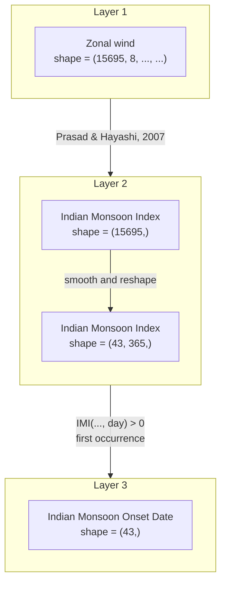

# Definition of Monsoon Onset

## Background

The Asian monsoon system is vast and complex, and no single index can fully capture its characteristics. As a result, the definition of “monsoon onset” in scientific studies often depends on the specific monsoon index being used.

In this project, the monsoon onset is defined based on the **Indian Monsoon Index (IMI)**, which is derived from the 850 hPa zonal wind shear.

## Indian Monsoon Index (IMI)

### Literature Basis

This project follows the definition introduced by **Prasad & Hayashi (2007)**, _“Large-scale summer monsoon rainfall over India and its relation to 850 hPa wind shear.”_

The IMI is calculated as the difference between the regional mean zonal winds at 850 hPa for two regions, one in the south and one in the north:

$$
\text{IMI} := \bar{u}_{\text{south}} - \bar{u}_{\text{north}}
$$

- **South region**: 5–15°N, 40–80°E
- **North region**: 20–30°N, 70–90°E

For the detailed formulation, see the original paper:

> ...The HWSI is defined as the shear in the 850 hPa zonal wind between a southern part (5–15°N, 40–80 °E; hereafter referred to as Zone 1) and a northern part (20–30°N,70–90 °E; hereafter referred to as Zone 2) of the Indian region.

### Post-Processing

Since the raw IMI time series contains a certain degree of noise, this project applies a **moving average filter** to smooth the data.

> **Appendix**  
> Corresponding scripts:
>
> ```{path}
> ~/src/python/notebooks/calculations.ipynb
> ```
>
> ```{path}
> ~/src/python/notebooks/constants.ipynb
> ```

## Monsoon Onset Definition

Building on the IMI, this project defines **monsoon onset** as:

**The first day of a given year when IMI becomes positive (IMI > 0).**

---

### Calculation Procedure

1. **Reshape the time series**  
   Convert daily IMI values into a two-dimensional array by year and day:

   $$
   \text{IMI}(15695,) \Longrightarrow \text{IMI}(43,365,)
   $$

2. **Identify first positive occurrence**  
   For each year, scan the daily sequence and locate the first day when IMI > 0.

3. **Assign onset date**  
   Convert the day index into a calendar date, which is recorded as the monsoon onset for that year.

```{pseudo code}
years = np.arange(1979, 2022)
onset_dates = np.argmax(indian_monsoon_index > 0, axis=1)
indian_monsoon_onset = list(zip(years, onset_dates))
```

> **Appendix**
> Corresponding script:
>
> ```{path}
> ~/src/python/main.ipynb
> ```

## Summary


