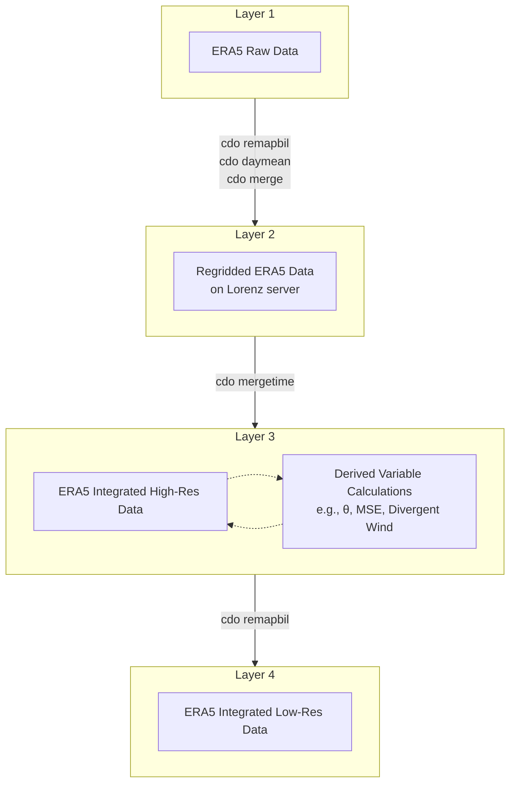

# Data Preprocessing

## Background

The dataset used in this project comes from **ERA5**, downloaded from **ECMWF** (see [here](https://cds.climate.copernicus.eu/datasets/reanalysis-era5-pressure-levels?tab=overview)) and regridded with `remapbil`.  
All raw files are stored in the main directory:

```{path}
/work/DATA/Reanalysis/ERA5
```

Example structure:

```
ERA5/
  u/
    u925_2021.nc
    u925_2020.nc
    ...
  v/
    v925_2021.nc
    v925_2020.nc
    ...
  slp/
    slp_2021.nc
    slp_2020.nc
  ...
```

Each subdirectory corresponds to one variable (e.g., zonal wind, temperature).
The key coordinates and structure are:

- **Time**: daily data, 1979–2021

- **Spatial coverage**: global

- **Vertical levels**: 8 pressure levels (1000 → 100 hPa)

- **Grid structure (after remapbil)**:
  - `gridtype = lonlat`
  - `xsize    = 576`
  - `ysize    = 360`
  - `xfirst   = 0.3125`
  - `xinc     = 0.625`
  - `yfirst   = -89.75`
  - `yinc     = 0.5`

File naming convention within each variable subdirectory:

- `{var}{plev}_{year}.nc`

## Merging

Each file contains a variable $\lambda$ with the structure:

$$
\lambda(\text{time}, \text{lat}, \text{lon}) \Longrightarrow \lambda(365 \space \text{or} \space 366, 360, 576)
$$

The files are merged using `cdo -mergetime`, with leap years handled by `cdo -del29feb`, resulting in:

$$
\lambda(\text{time}, \text{lat}, \text{lat}) \underset{merge}{\Longrightarrow} \lambda(\text{time}^*, \text{plev}^*, \text{lat}, \text{lat})
$$

Which expands to:

$$
\lambda(365 \times 43, 8, 360, 576) \Longrightarrow \lambda(15695, 8, 360, 576)
$$

The merged outputs are stored in:

```{path}
/work/b08209033/DATA/IndianMonsoon/ERA5/raw_grid
```

For most variables, the resulting dimensions are:

$$
\lambda(15695, 8, 360, 576)
$$

**Special case**: If a variable is defined only at a single pressure level, the vertical dimension is omitted:

$$
\lambda(15695, 360, 576)
$$

> **Appendix**
> Corresponding scripts:
>
> ```{path}
> ~/src/bash/cdo/ERA5_regrid
> ```

## Derived Variables

ERA5 primarily provides basic physical quantities.
Some derived fields (e.g., potential temperature, moist static energy, divergent wind) must be computed separately.

These derived variables are calculated using NCL or cdo, with outputs stored in:

```{path}
/work/b08209033/DATA/IndianMonsoon/ERA5/raw_grid
```

其典型維度仍為：

$$
\lambda(15695, 8, 360, 576)
$$

> **Appendix**
> Corresponding scripts:
>
> ```{path}
> ~/src/bash/cdo/ERA5_decomposition
> ```
>
> ```{path}
> ~/src/bash/ncl/calculation
> ```

## Horizontal Downscaling

For this project, the horizontal resolution $576 \times 360$ is still too high.
Therefore, the data are spatially downscaled from:

$$
576 \times 360 \Longrightarrow 144 \times 90
$$

The downscaled outputs are stored in:

```{path}
/work/b08209033/DATA/IndianMonsoon/ERA5/sparse_grid
```

Resulting dimensions:

$$
\lambda(15695, 8, 90, 144)
$$

## Summary


